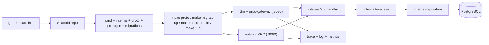

# go-template

`go-template` is a generator CLI for bootstrapping Go backend services.

## Install

Install from Go module:

```bash
go install github.com/ThinhDangDev/go-template/cmd/go-template@latest
```

Install from local source:

```bash
git clone git@github.com:ThinhDangDev/go-template.git
cd go-template
make install
```

`make install` installs the binary into `${GOBIN}` if set, otherwise `$(go env GOPATH)/bin`.

If `go-template` is not found after install, add your Go bin directory to `PATH`:

```bash
export PATH="$(go env GOPATH)/bin:$PATH"
```

## Usage

```bash
go-template init my-service
go-template init my-service --module github.com/acme/my-service
```

The generated project includes:

- CLI-first app commands: `serve`, `migrate`, `seed`
- Gin HTTP server + grpc-gateway
- native gRPC server
- Protocol Buffers with committed `protogen`
- `make proto` and generated OpenAPI JSON
- manual SQL migrations with `up/down/status/create`
- JWT authentication
- Casbin RBAC
- Prometheus metrics
- OpenTelemetry tracing
- structured JSON logging
- Docker + docker-compose

The generated project currently serves:

- `10` HTTP endpoints total
- `4` infrastructure endpoints: `/healthz`, `/readyz`, `/metrics`, `/swagger.json`
- `6` application HTTP endpoints exposed through Gin + grpc-gateway
- `6` native gRPC methods in `TemplateService`

## Template Flow



## Local Development

```bash
go build ./cmd/go-template
go test ./...
go run ./cmd/go-template init demo-api
```

The generated project exposes HTTP on `:8080` and gRPC on `:9090` by default.

## Generated Project Flow

After running `go-template init <project-name>`:

```bash
cd <project-name>
cp .env.example .env
```

Set at least:

```bash
JWT_SECRET=replace-with-a-long-random-secret
ADMIN_PASSWORD=ChangeMe123!
```

Then run:

```bash
make proto
make migrate-up
make seed-admin
make run
```
