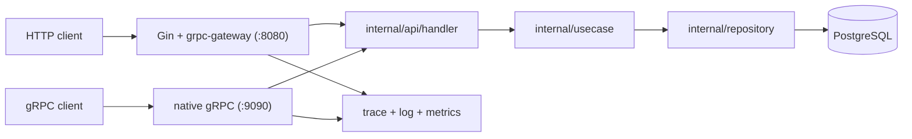

# __PROJECT_NAME__

`__PROJECT_NAME__` is a CLI-first Go backend template with:

- Gin HTTP server
- Protocol Buffers + grpc-gateway
- native gRPC server bootstrap
- manual SQL migrations with `up/down/status/create`
- JWT authentication with public register/login
- Casbin RBAC
- admin user access management APIs
- structured JSON logging
- Prometheus metrics
- OpenTelemetry tracing
- OpenAPI JSON generation

## Commands

```bash
make proto
make swagger
go run ./cmd/main.go serve
go run ./cmd/main.go migrate up
go run ./cmd/main.go migrate down --steps 1
go run ./cmd/main.go migrate status
go run ./cmd/main.go migrate create add_audit_log
go run ./cmd/main.go seed admin --email admin@example.com --password ChangeMe123!
```

## Quick Start

1. Copy `.env.example` to `.env`.
2. Generate proto, grpc-gateway, and OpenAPI artifacts:

```bash
make proto
```

3. Start PostgreSQL.
4. Apply migrations:

```bash
make migrate-up
```

5. Seed the first admin:

```bash
make seed-admin
```

6. Start the API:

```bash
make run
```

`serve` fails fast if the required schema is missing, so migrations must run first.

## Architecture Flow



## Routes

This template currently serves `12` HTTP endpoints total:

- `4` infrastructure endpoints: `/healthz`, `/readyz`, `/metrics`, `/swagger.json`
- `8` application endpoints from `TemplateService`

- `GET /healthz`
- `GET /readyz`
- `GET /metrics`
- `GET /swagger.json`
- `GET /api/v1/public/ping`
- `POST /api/v1/auth/register`
- `POST /api/v1/auth/login`
- `GET /api/v1/auth/me`
- `GET /api/v1/admin/ping`
- `GET /api/v1/admin/users`
- `GET /api/v1/admin/roles`
- `PATCH /api/v1/admin/users/:user_id/access`

The same template also serves `8` native gRPC methods:

- `PublicPing`
- `Register`
- `Login`
- `Me`
- `AdminPing`
- `ListUsers`
- `ListRoles`
- `UpdateUserAccess`

HTTP JSON is served by Gin + grpc-gateway on port `8080` by default. Native gRPC is served on port `9090` by default using the same service handlers and auth/RBAC rules.

New users can self-register through `POST /api/v1/auth/register` and receive a JWT immediately with the default `viewer` role. Admins can then inspect users, inspect supported roles, and update a user's `role` plus `is_active` flag through the admin access APIs.

## Project Layout

```text
cmd/main.go
configs/rbac_model.conf
generate.sh
internal/api/handler/
internal/app/
internal/auth/
internal/cli/
internal/config/
internal/domain/
  entity/
  interface/
    repository/
    usecase/
internal/http/
internal/pkg/authctx/
internal/repository/
internal/telemetry/
internal/usecase/
internal/docs/
migrations/sql/
proto/
protogen/
third_party/googleapis/
```

## Environment

Required for runtime:

- `JWT_SECRET`

Common optional variables:

- `DATABASE_URL`
- `POSTGRES_*`
- `GRPC_HOST`
- `GRPC_PORT`
- `SWAGGER_JSON_PATH`
- `OTEL_EXPORTER_OTLP_ENDPOINT`
- `LOG_ENABLE_FILE`

## Docker

```bash
docker compose up -d postgres
JWT_SECRET=replace-with-a-secret go run ./cmd/main.go migrate up
JWT_SECRET=replace-with-a-secret go run ./cmd/main.go seed admin --password ChangeMe123!
docker build -t __PROJECT_NAME__ .
docker run --rm -p 8080:8080 --env-file .env __PROJECT_NAME__
```

The container starts with `serve`; migrations stay manual by design.

## Proto Tooling

Install generators once:

```bash
go install google.golang.org/protobuf/cmd/protoc-gen-go@latest
go install google.golang.org/grpc/cmd/protoc-gen-go-grpc@latest
go install github.com/grpc-ecosystem/grpc-gateway/v2/protoc-gen-grpc-gateway@latest
go install github.com/grpc-ecosystem/grpc-gateway/v2/protoc-gen-openapiv2@latest
```

Then regenerate:

```bash
make proto
```
